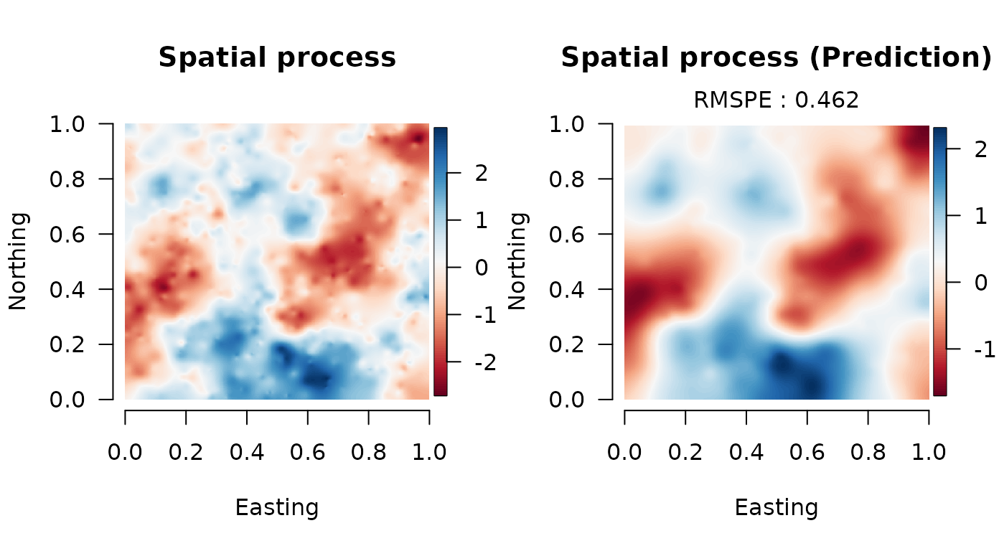
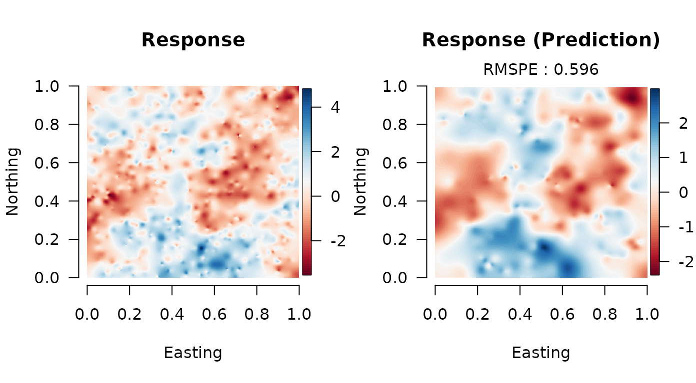

# Double Bayesian Predictive Stacking for Spatial Analysis - Tutotial

We provide a brief tutorial of the `spBPS` package. Here we shows the
implementation of the Double Bayesian Predictive Stacking on
synthetically univariate generated data. In particular, we focus on
parallel computing using the packages `parallel`, `doParallel`; but it
is not mandatory: it suffices to make it sequential. For any further
details please refer to (Presicce and Banerjee 2024). More examples, for
multivariate data, are available in documentation, and functions help.

``` r
library(spBPS)
```

### Working packages

``` r
library(foreach)
library(parallel)
library(doParallel)
library(tictoc)
library(MBA)
library(classInt)
library(RColorBrewer)
library(sp)
library(fields)
library(mvnfast)
library(abind)
```

### Data generation

We generate data from the model detailed in Equation (2.4) (Presicce and
Banerjee 2024), over a unit square.

``` r
# dimensions
n <- 1000
u <- 250
p <- 2
q <- 1

# parameters
B <- c(-0.75, 1.85)
tau2 <- 0.25
sigma2 <- 1
delta <- tau2/sigma2
phi <- 4

set.seed(4-8-15-16-23-42)
# generate sintethic data
crd <- matrix(runif((n+u) * 2), ncol = 2)
X_or <- cbind(rep(1, n+u), matrix(runif((p-1)*(n+u)), ncol = (p-1)))
D <- spBPS:::arma_dist(crd)
Rphi <- exp(-phi * D)
W_or <- matrix(0, n+u) + mniw::rmNorm(1, rep(0, n+u), sigma2*Rphi)
Y_or <- X_or %*% B + W_or + mniw::rmNorm(1, rep(0, n+u), diag(delta*sigma2, n+u))

# train data
crd_s <- crd[1:n, ]
X <- X_or[1:n, ]
W <- W_or[1:n, ]
Y <- Y_or[1:n, ]

# prediction data
crd_u <- crd[-(1:n), ]
X_u <- X_or[-(1:n), ]
W_u <- W_or[-(1:n), ]
Y_u <- Y_or[-(1:n), ]
```

### Setting priors and hyperparameters

``` r
# priors 
priors <- list(mu_B = matrix(0, nrow = p, ncol = q),
               V_r = diag(10, p),
               Psi = diag(1, q),
               nu = 3)

# hyperparameters values
alfa_seq <- c(0.7, 0.8, 0.9)
phi_seq <- c(3, 4, 5)
hyperpar <- list(alpha = alfa_seq, phi = phi_seq)
```

### Setting dimensions

``` r
# subset dimension
subset_size <- 500

# number of posterior draws
R <- 200

# number of computational cores
n_core <- 2
```

### Double BPS parallel fit

Parallel implementation, exploiting 2 computing core.

``` r
out <- spBPS(data = list(Y = Y, X = X),
      priors = priors,
      coords = crd_s,
      hyperpar = hyperpar,
      subset_size = subset_size,
      combine_method = "bps",
      draws = R,
      newdata = list(X = X_u, coords = crd_u),
      cores = n_core)
```

### Results collection

``` r
# statistics computations W
pred_mat_W <- do.call(abind, c(lapply(out$predictive, function(x) x$Wu), along = 3))
post_mean_W <- apply(pred_mat_W, c(1,2), mean)
post_qnt_W <- apply(pred_mat_W, c(1,2), quantile, c(0.025, 0.975))

# Empirical coverage for W
coverage_W <- mean(W_u >= post_qnt_W[1,,1] & W_u <= post_qnt_W[2,,1])
cat("Empirical coverage for Spatial process:", round(coverage_W, 3),"\n")
#> Empirical coverage for Spatial process: 0.976

# statistics computations Y
pred_mat_Y <- do.call(abind, c(lapply(out$predictive, function(x) x$Yu), along = 3))
post_mean_Y <- apply(pred_mat_Y, c(1,2), mean)
post_qnt_Y <- apply(pred_mat_Y, c(1,2), quantile, c(0.025, 0.975))

# Empirical coverage for Y
coverage_Y <- mean(Y_u >= post_qnt_Y[1,,1] & Y_u <= post_qnt_Y[2,,1])
cat("Empirical coverage for Response:", round(coverage_Y, 3),"\n")
#> Empirical coverage for Response: 0.968

# Root Mean Square Prediction Error
rmspe_W <- sqrt( mean( (W_u - post_mean_W)^2 ) )
rmspe_Y <- sqrt( mean( (Y_u - post_mean_Y)^2 ) )
cat("RMSPE for Spatial process:", round(rmspe_W, 3), "\n")
#> RMSPE for Spatial process: 0.462
cat("RMSPE for Response:", round(rmspe_Y, 3), "\n")
#> RMSPE for Response: 0.596
```

### Plot results



## 

Presicce, Luca, and Sudipto Banerjee. 2024. “Bayesian Transfer Learning
for Artificially Intelligent Geospatial Systems: A Predictive Stacking
Approach.” *arXiv Preprint*, arXiv:2410.09504.
<https://doi.org/10.48550/arXiv.2410.09504>.
