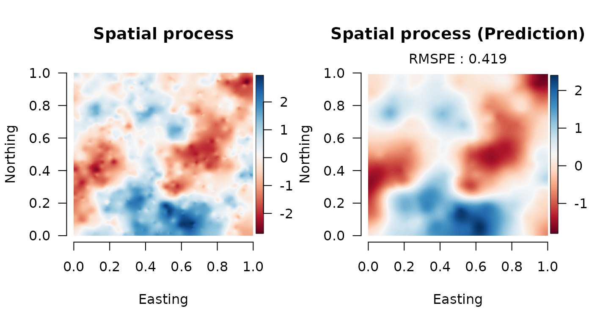
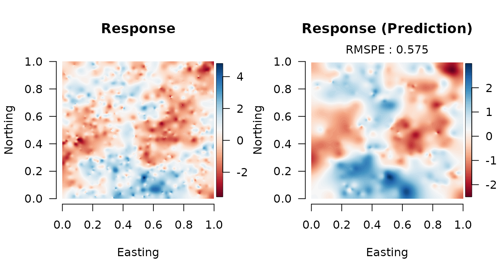

# Double Bayesian Predictive Stacking for (univariate) Spatial Analysis - Tutotial

We provide a brief tutorial of the `spBPS` package. Here we shows the
implementation of the Double Bayesian Predictive Stacking on
synthetically univariate generated data. In particular, we focus on
parallel computing using the packages `parallel`, `doParallel`; but it
is not mandatory: it suffices to make it sequential. For any further
details please refer to (Presicce and Banerjee 2024). More examples, for
multivariate data, are available in documentation, and functions help.

``` r
library(spBPS)
```

### Working packages

``` r
library(foreach)
library(parallel)
library(doParallel)
library(tictoc)
library(MBA)
library(classInt)
library(RColorBrewer)
library(sp)
library(fields)
library(mvnfast)
```

### Data generation

We generate data from the model detailed in Equation (2.4) (Presicce and
Banerjee 2024), over a unit square.

``` r
# dimensions
n <- 1000
u <- 250
p <- 2

# parameters
B <- c(-0.75, 1.85)
tau2 <- 0.25
sigma2 <- 1
delta <- tau2/sigma2
phi <- 4

set.seed(4-8-15-16-23-42)
# generate sintethic data
crd <- matrix(runif((n+u) * 2), ncol = 2)
X_or <- cbind(rep(1, n+u), matrix(runif((p-1)*(n+u)), ncol = (p-1)))
D <- arma_dist(crd)
Rphi <- exp(-phi * D)
W_or <- matrix(0, n+u) + mniw::rmNorm(1, rep(0, n+u), sigma2*Rphi)
Y_or <- X_or %*% B + W_or + mniw::rmNorm(1, rep(0, n+u), diag(delta*sigma2, n+u))

# train data
crd_s <- crd[1:n, ]
X <- X_or[1:n, ]
W <- W_or[1:n, ]
Y <- Y_or[1:n, ]

# prediction data
crd_u <- crd[-(1:n), ]
X_u <- X_or[-(1:n), ]
W_u <- W_or[-(1:n), ]
Y_u <- Y_or[-(1:n), ]
```

### Subset posterior models

We opt to divide the original data into `K=2`, such that each subsets
results in 500 locations.

``` r
# hyperparameters values
delta_seq <- c(0.2, 0.25, 0.3)
phi_seq <- c(3, 4, 5)

# function for the fit loop
fit_loop <- function(i) {

  Yi <- data_part$Y_list[[i]]
  Xi <- data_part$X_list[[i]]
  crd_i <- data_part$crd_list[[i]]
  p <- ncol(Xi)
  bps <- spBPS::BPS_weights(data = list(Y = Yi, X = Xi),
                           priors = list(mu_b = matrix(rep(0, p)),
                                         V_b = diag(10, p),
                                         a = 2,
                                         b = 2), coords = crd_i,
                           hyperpar = list(delta = delta_seq, phi = phi_seq), K = 5)
  w_hat <- bps$W
  epd <- bps$epd

  result <- list(epd, w_hat)
  return(result)

}

# function for the pred loop
pred_loop <- function(r) {

  ind_s <- subset_ind[r]
  Ys <- matrix(data_part$Y_list[[ind_s]])
  Xs <- data_part$X_list[[ind_s]]
  crds <- data_part$crd_list[[ind_s]]
  Ws <- W_list[[ind_s]]
  result <- spBPS::BPS_post(data = list(Y = Ys, X = Xs), coords = crds,
                           X_u = X_u, crd_u = crd_u,
                           priors = list(mu_b = matrix(rep(0, p)),
                                         V_b = diag(10, p),
                                         a = 2,
                                         b = 2),
                           hyperpar = list(delta = delta_seq, phi = phi_seq),
                           W = Ws, R = 1)

  return(result)
}


# subsetting data
subset_size <- 500
K <- n/subset_size
data_part <- subset_data(data = list(Y = matrix(Y), X = X, crd = crd_s), K = K)
```

### Double BPS parallel fit

Parallel implementation, exploiting 2 computing core.

``` r
# number of clusters for parallel implementation
n.core <- 2

# list of function
funs_fit <- lsf.str()[which(lsf.str() != "fit_loop")]

# list of function
funs_pred <- lsf.str()[which(lsf.str() != "pred_loop")]

# starting cluster
cl <- makeCluster(n.core)
registerDoParallel(cl)

# timing
tic("total")

# parallelized subset computation of GP in different cores
tic("fit")
obj_fit <- foreach(i = 1:K, .noexport = funs_fit) %dopar% { fit_loop(i) }
fit_time <- toc()

gc(verbose = F)
# Combination using double BPS
tic("comb")
comb_bps <- BPS_combine(obj_fit, K, 1)
comb_time <- toc()
Wbps <- comb_bps$W
W_list <- comb_bps$W_list

gc(verbose = F)
# parallelized subset computation of GP in different cores
R <- 250
subset_ind <- sample(1:K, R, T, Wbps)
tic("prediction")
predictions <- foreach(r = 1:R, .noexport = funs_pred) %dopar% { pred_loop(r) }
prd_time <- toc()

# timing
tot_time <- toc()

# closing cluster
stopCluster(cl)
gc(verbose = F)
```

### Results collection

``` r
# statistics computations W
pred_mat_W <- sapply(1:R, function(r){predictions[[r]][[1]]})
post_mean_W <- rowMeans(pred_mat_W)
post_var_W <- apply(pred_mat_W, 1, sd)
post_qnt_W <- apply(pred_mat_W, 1, quantile, c(0.025, 0.975))

# Empirical coverage for W
coverage_W <- mean(W_u >= post_qnt_W[1,] & W_u <= post_qnt_W[2,])
cat("Empirical coverage for Spatial process:", round(coverage_W, 3),"\n")
#> Empirical coverage for Spatial process: 0.992

# statistics computations Y
pred_mat_Y <- sapply(1:R, function(r){predictions[[r]][[2]]})
post_mean_Y <- rowMeans(pred_mat_Y)
post_var_Y <- apply(pred_mat_Y, 1, sd)
post_qnt_Y <- apply(pred_mat_Y, 1, quantile, c(0.025, 0.975))

# Empirical coverage for Y
coverage_Y <- mean(Y_u >= post_qnt_Y[1,] & Y_u <= post_qnt_Y[2,])
cat("Empirical coverage for Response:", round(coverage_Y, 3),"\n")
#> Empirical coverage for Response: 0.972

# Root Mean Square Prediction Error
rmspe_W <- sqrt( mean( (W_u - post_mean_W)^2 ) )
rmspe_Y <- sqrt( mean( (Y_u - post_mean_Y)^2 ) )
cat("RMSPE for Spatial process:", round(rmspe_W, 3), "\n")
#> RMSPE for Spatial process: 0.419
cat("RMSPE for Response:", round(rmspe_Y, 3), "\n")
#> RMSPE for Response: 0.575
```

### Plot results



## 

Presicce, Luca, and Sudipto Banerjee. 2024. “Bayesian Transfer Learning
for Artificially Intelligent Geospatial Systems: A Predictive Stacking
Approach.” *arXiv Preprint*, arXiv:2410.09504.
<https://doi.org/10.48550/arXiv.2410.09504>.
